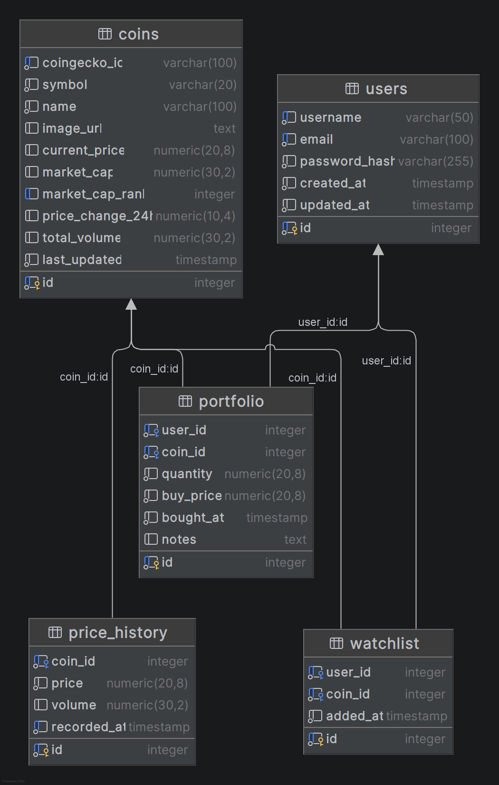

# 🗄️ CryptoView — Database

База данных крипто-дашборда. Спроектирована для хранения пользователей, монет, портфелей и истории цен.

## 🛠 Технологии

- **СУБД:** PostgreSQL 18
- **Инструменты:** pgAdmin 4, WebStorm Database Tools

## 📐 ER-диаграмма



## 📋 Структура базы данных

### Таблицы

| Таблица         | Описание                                    |
|-----------------|---------------------------------------------|
| `users`         | Пользователи приложения                     |
| `coins`         | Монеты — кэш данных с CoinGecko API         |
| `watchlist`     | Избранные монеты пользователя               |
| `portfolio`     | Портфель — купленные монеты с ценой покупки |
| `price_history` | История цен монет                           |

### Связи

```
users (1) ──→ (M) watchlist  (M) ←── (1) coins
users (1) ──→ (M) portfolio  (M) ←── (1) coins
coins (1) ──→ (M) price_history
```

### Описание таблиц

**Users**
| Поле | Тип | Описание |
|---|---|---|
| id | SERIAL PK | Уникальный идентификатор |
| username | VARCHAR(50) UNIQUE | Имя пользователя |
| email | VARCHAR(100) UNIQUE | Email |
| password_hash | VARCHAR(255) | Хэш пароля |
| created_at | TIMESTAMP | Дата регистрации |
| updated_at | TIMESTAMP | Дата обновления |

**Coins**
| Поле | Тип | Описание |
|---|---|---|
| id | SERIAL PK | Уникальный идентификатор |
| coingecko_id | VARCHAR(100) UNIQUE | ID монеты в CoinGecko API |
| symbol | VARCHAR(20) | Тикер (BTC, ETH...) |
| name | VARCHAR(100) | Название |
| current_price | NUMERIC(20,8) | Текущая цена в USD |
| market_cap | NUMERIC(30,2) | Рыночная капитализация |
| market_cap_rank | INTEGER | Место по капитализации |
| price_change_24h | NUMERIC(10,4) | Изменение цены за 24ч (%) |
| total_volume | NUMERIC(30,2) | Объём торгов за 24ч |
| last_updated | TIMESTAMP | Время последнего обновления |

**Watchlist**
| Поле | Тип | Описание |
|---|---|---|
| id | SERIAL PK | Уникальный идентификатор |
| user_id | INTEGER FK → users | Пользователь |
| coin_id | INTEGER FK → coins | Монета |
| added_at | TIMESTAMP | Дата добавления |

**Portfolio**
| Поле | Тип | Описание |
|---|---|---|
| id | SERIAL PK | Уникальный идентификатор |
| user_id | INTEGER FK → users | Пользователь |
| coin_id | INTEGER FK → coins | Монета |
| quantity | NUMERIC(20,8) | Количество монет |
| buy_price | NUMERIC(20,8) | Цена покупки в USD |
| bought_at | TIMESTAMP | Дата покупки |
| notes | TEXT | Заметки |

**Price_history**
| Поле | Тип | Описание |
|---|---|---|
| id | SERIAL PK | Уникальный идентификатор |
| coin_id | INTEGER FK → coins | Монета |
| price | NUMERIC(20,8) | Цена в USD |
| volume | NUMERIC(30,2) | Объём торгов |
| recorded_at | TIMESTAMP | Время записи |

## 📁 Файлы

| Файл             | Описание                           |
|------------------|------------------------------------|
| `schema.sql`     | Создание таблиц, ключей и индексов |
| `seed.sql`       | Тестовые данные                    |
| `queries.sql`    | Демонстрационные SQL-запросы       |
| `er-diagram.png` | ER-диаграмма базы данных           |

## 🚀 Установка

```bash
# Создать базу данных
psql -U postgres -c "CREATE DATABASE cryptoview;"

# Создать таблицы
psql -U postgres -d cryptoview -f schema.sql

# Заполнить тестовыми данными
psql -U postgres -d cryptoview -f seed.sql
```

## 🔍 Примеры запросов

```sql
-- Портфель пользователя с прибылью/убытком
SELECT
    c.name, p.quantity, p.buy_price,
    c.current_price,
    ROUND((c.current_price - p.buy_price) / p.buy_price * 100, 2) AS profit_pct
FROM portfolio p
JOIN coins c ON c.id = p.coin_id
WHERE p.user_id = 1
ORDER BY profit_pct DESC;

-- Самые популярные монеты в избранном
SELECT c.name, c.symbol, COUNT(w.id) AS в_избранном
FROM watchlist w
JOIN coins c ON c.id = w.coin_id
GROUP BY c.id, c.name, c.symbol
ORDER BY в_избранном DESC;
```

Полный список запросов — в файле [`queries.sql`](queries.sql).

## 🎓 Учебная практика УП.11

Этот репозиторий — часть дипломного проекта **CryptoView**.  
Смежный модуль (фронтенд): [cryptoview-app/frontend](https://github.com/cryptoview-app/frontend)